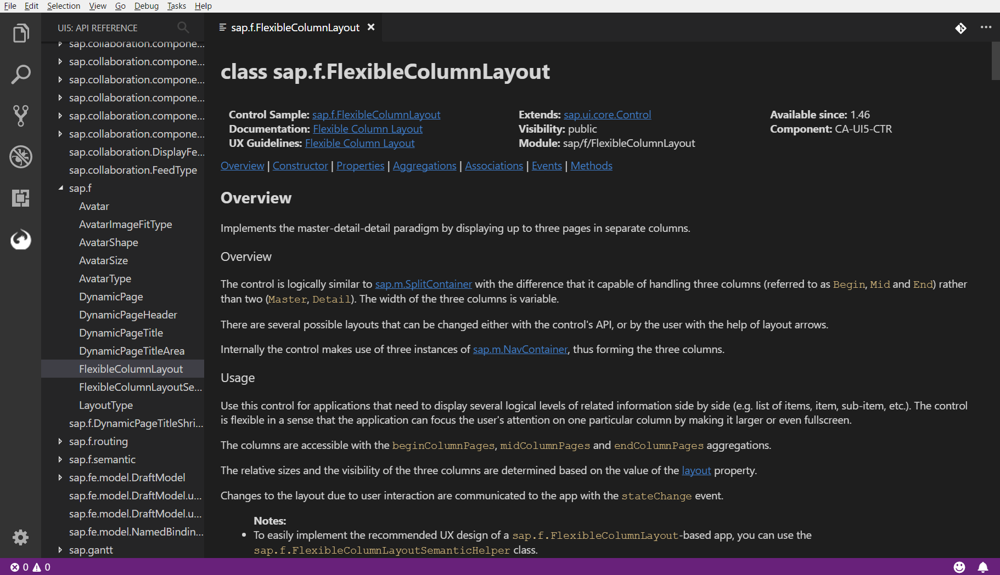

# UI5 Explorer

This extension brings api reference for [SAPUI5](https://sapui5.hana.ondemand.com/) and [OpenUI5](https://openui5.org/) Frameworks directly into the [Visual Studio Code](https://code.visualstudio.com/).

## Features

### Browse

You can browse through the whole api reference using new activity bar panel. To open the browser simply click the UI5 icon:

### Search

UI5 Explorer also allows you to search for specific module you want to invesitage. To open search bar you can simply click the search icon:

Or execute **UI5 Explorer: Search** command:

After that you will be prompted to select which module you want to open:

### Explore

When you select a module to explore either by selecting it from tree or by search input you can see the whole module description:

Currently these parts are supported and displayed:
  * Header with general information (library, component, version, links...)
  * Overview description
  * Constructor
  * Fields
  * Methods
  * Events
  * Properties
  * Aggregations
  * Associations

In the future there will be added support for:
  * Inherited method, properties etc.
  * Collapsible/Expandable methods and events descriptions
  * Kind of *Table of contents* at the top of the page
  * Outline view under the Api Reference tree browser

Within the module exploration there are several link types fully working:
  * Anchor links that scolls the page to the method/event of the current module
  
  * Api links that navigates you to the new view with another module explorer
  
  * External links navigating you to the external sources (eg. documentation, guidelines etc.)
  

## Extension Settings

This extension contributes the following settings:

* `ui5explorer.framework`: select whether to fetch data for [OpenUI5](https://openui5.org/) (default) or [SAPUI5](https://sapui5.hana.ondemand.com/) Framework

## Release Notes

### 0.0.1

First beta version

## FAQ

Feel free to open a new issue github if you find something not working or if you have some feature request.

**Enjoy!**
